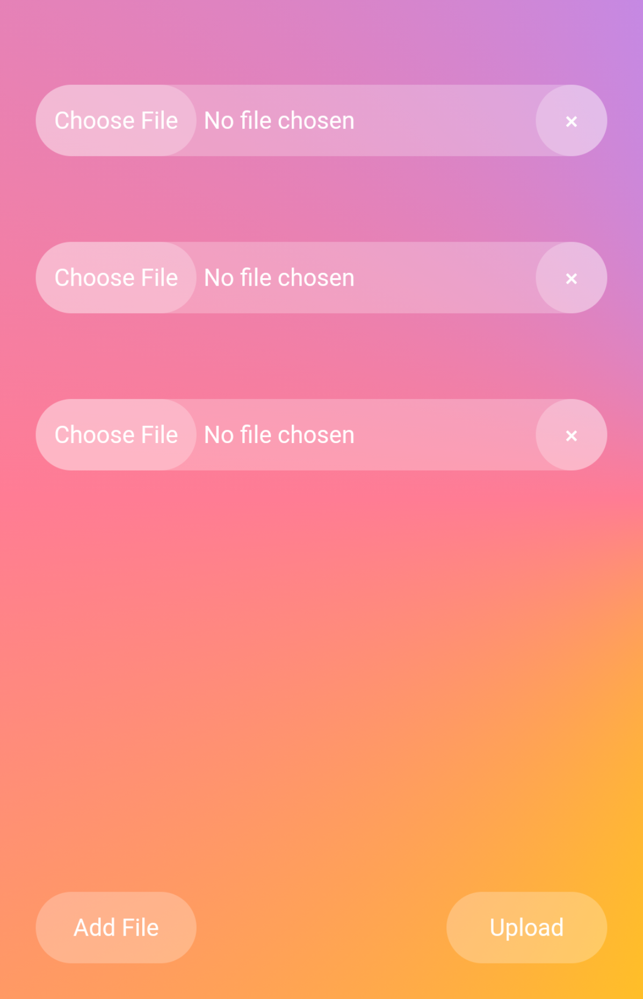

# FileSharer
A simple NodeJS server to share files with devices on the same network.

 

## Getting Started
* Clone this repository
* `cd FileSharer`
* Execute `npm install`

 

## How to Use
* Set the `password` variable in `./public/index.html`, `./public/upload.html`, and `./public/download.html`. (This is to prevent anyone on the same network from uploading/downloading files without the password)
* Execute `npm start`
* Go to the network address printed in terminal from another device (on the same network) or scan the QR-Code and upload/download files
* To send files to other devices, copy the desired files into the `outgoing` directory
* Uploaded files are stored in the `incoming` directory

 

## Demo

